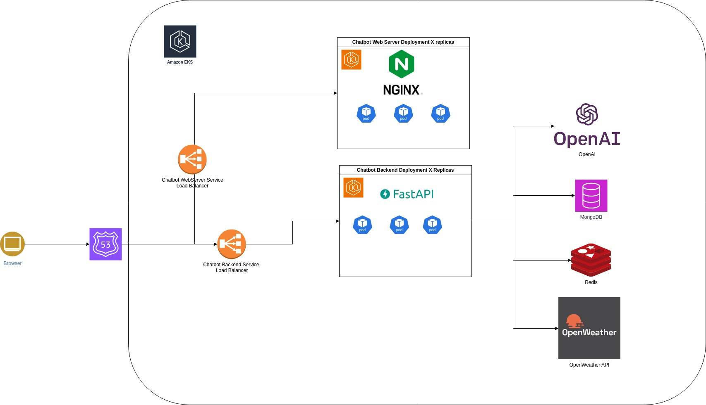
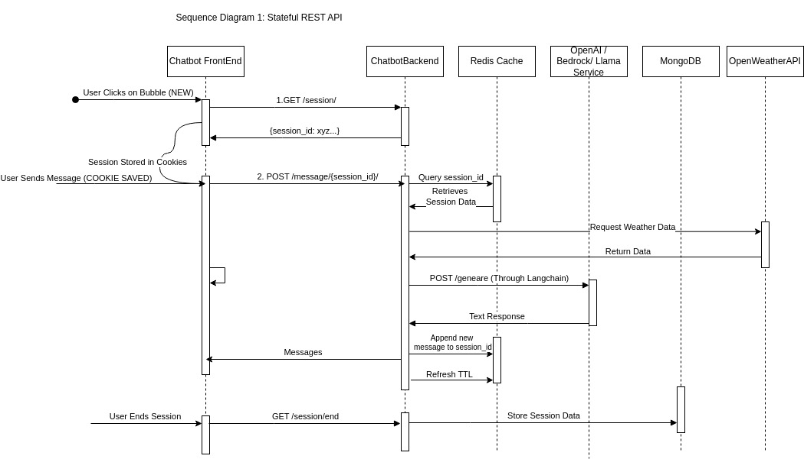

# Weather AI Assistant

This is a FastAPI application that runs on Uvicorn at port 8000. It provides an AI-powered weather assistant that can answer questions and provide information about weather 

## Easy deployment

1. Set the following env vars in the `docker-compose` file

```
      - API_KEY=
      - OPENAI_API_KEY=
```

2. Run

```
docker compose up --build -d
```

3. Check `localhost:8000/docs`

4. Check the sequence Diagram

## Overall Architecture



This diagram illustrates the final and proposed architecture of the chat application. Here's a breakdown of the components and their roles:

- **Browser**: This represents the client-side interface where users interact with the chat application through a web browser.

- **Amazon EKS**: This is an Amazon Web Services (AWS) service called Elastic Kubernetes Service, which is a managed Kubernetes offering for deploying and scaling containerized applications.

- **Chatbot Web Server Deployment**: This section shows multiple replicas (X replicas) of the web server responsible for handling the chatbot's frontend. It uses NGINX as a reverse proxy and load balancer to distribute incoming requests across the replicas.

- **Chatbot Web Server Service Load Balancer**: This is an AWS load balancer service that distributes traffic across the Chatbot Web Server Deployment replicas.

- **Chatbot Backend Deployment**: This section depicts multiple replicas (X replicas) of the backend service responsible for processing user messages and generating responses. It utilizes FastAPI, a modern web framework for building APIs with Python.

- **Chatbot Backend Service Load Balancer**: This is an AWS load balancer service that distributes traffic across the Chatbot Backend Deployment replicas.

- **OpenAI**: Represents the integration with OpenAI's language models, which are used to generate natural language responses for the chatbot.

- **MongoDB**: Used for storing chatbot data, such as user conversations, context, and other relevant information.

- **Redis**: This is an in-memory data store used for caching session data.

# Sequence Diagram



This sequence diagram illustrates the flow of a stateful REST API for a chatbot application. Here's an explanation of the steps involved:

1. **User Clicks on Bubble (NEW)**: This represents a new user interaction with the chatbot frontend.

2. **GET /session/**: The frontend sends a GET request to the backend to initiate a new session. The backend generates a unique session ID (e.g., `session_id`, `xyz_...`) and returns it to the frontend.

3. **Session Stored in Cookies**: The frontend stores the received session ID in the user's browser cookies.

4. **User Sends Message (COOKIE SAVED)**: The user sends a message to the chatbot, and the frontend includes the session ID stored in the cookies with the request.

5. **POST /message/{session_id}**: The frontend sends a POST request with the user's message and the session ID to the backend.

6. **Query session_id**: The backend queries the Redis cache using the provided session ID to retrieve the associated session data.

7. **Retrieve Session Data**: The Redis cache returns the session data for the given session ID.

8. **Request Weather Data**: If the user's message requires weather information, the backend makes a request to the OpenWeatherAPI service.

9. **Return Data**: The OpenWeatherAPI service returns the requested weather data.

10. **POST /generate (Through Langchain)**: The backend sends the user's message, session data, and any additional data (like weather data) to the OpenAI/Bedrock Llama service for generating a response using language models (possibly through Langchain, a framework for building applications with large language models).

11. **Text Response**: The OpenAI/Bedrock Llama service generates and returns a text response to the backend.

12. **Append new message to session_id**: The backend appends the generated response to the session data associated with the session ID.

13. **Refresh TTL**: The backend refreshes the time-to-live (TTL) for the session data in the Redis cache.

14. **Messages**: The backend sends the generated response back to the frontend, which displays it to the user as part of the conversation.

15. **User Ends Session**: When the user ends the session, the frontend sends a GET request to the backend to terminate the session.

16. **GET /session/end**: The backend receives the request to end the session.

17. **Store Session Data**: The backend stores the final session data, including the conversation history, in a persistent storage like MongoDB.

The sequence diagram showcases the communication between the frontend, backend, Redis cache, OpenAI/Bedrock Llama service, MongoDB, and OpenWeatherAPI. It highlights the stateful nature of the chatbot, where user conversations are maintained across requests using session IDs and cached session data.